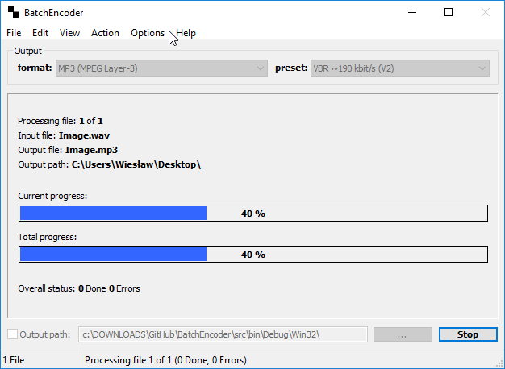
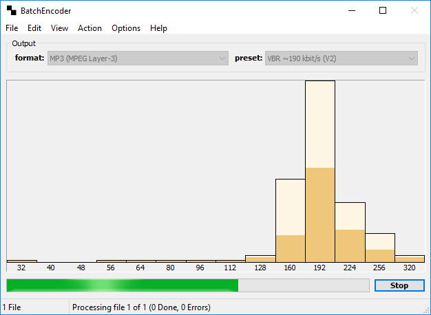

# BatchEncoder

BatchEncoder is an audio files conversion software.

### Download BatchEncoder

| Platforn              | Type        | Version       | Download                                                                                                                               |
|-----------------------|-------------|---------------|----------------------------------------------------------------------------------------------------------------------------------------|
| Windows 32-bit        | Installer   | 1.0           | [BatchEncoder-1.0-Win32.exe](https://github.com/wieslawsoltes/BatchEncoder/releases/download/1.0/BatchEncoder-1.0-Win32.exe)                      |
| Windows 64-bit        | Installer   | 1.0           | [BatchEncoder-1.0-x64.exe](https://github.com/wieslawsoltes/BatchEncoder/releases/download/1.0/BatchEncoder-1.0-x64.exe)          |
| Windows 32-bit        | Portable    | 1.0           | [BatchEncoder-1.0-Win32.zip](https://github.com/wieslawsoltes/BatchEncoder/releases/download/1.0/BatchEncoder-1.0-Win32.zip)                      |
| Windows 64-bit        | Portable    | 1.0           | [BatchEncoder-1.0-x64.zip](https://github.com/wieslawsoltes/BatchEncoder/releases/download/1.0/BatchEncoder-1.0-x64.zip)          |

## About

BatchEncoder is an audio files conversion software. It supports most of popular audio file formats 
including lossy and lossless compression. The main program window is simple in usage and design. 
BatchEncoder is basically GUI front-end for command-line tools. All it does is creating background 
processes and passing arguments to it with options you select from presets/format menu and additionally 
adding input and output file paths. This help file describes very basic futures and usage of the application. 
For specific options for each format use help available for command-line tools.

## Features

* Audio conversion utility GUI.
* Support for most popular audio formats.
* Easily configurable by newbies.
* Advanced options for experienced users.
* Open-source, fast and simple.

## Screenshots

## Command-Line

    USAGE: BatchEncoder
           Default GUI interface.
    
    USAGE: BatchEncoder [SETTINGS] [OPTIONS] [FILES]
           Default GUI interface with additional command-line options.
    
    USAGE: BatchEncoder [TOOLS]
           GUI stand-alone tools.
    
    SETTINGS:
    
    --settings <[path]filename>         Set main program settings file.
                                        <[path]filename> = configuration filename
    --scf, --current-format <format>    Set current output format.
    --scp, --current-preset <preset>    Set current output preset.
    --ldp, --load-presets <[path]filename>
                                        Load presets configuration from file.
    --ldf, --load-formats <[path]filename>
                                        Load formats configuration from file.
    
    OPTIONS:
    
    --stc, --start-conversion           Start conversion when loaded all settings.
    --spc, --stop-conversion            Works only with --single-instance switch.
    -i, --si, --single-instance         Run only one instance of a program.
    -m, --min, --minimize               Minimize main window to taskbar.
    -t, --pt, --progress-type <type>    Conversion rogress type. Default: normal
                                        <type> = normal (default progressbar)
                                        <type> = extended (extended progress window)
                                        <type> = histogram (histogram window)
                                        <type> = console (forced console window)
    --sd, --shutdown <mode>             Shutdown system or exit the program.
                                        <mode> = now (only shutdown the system)
                                        <mode> = done (when conversion is done)
                                        <mode> = exit (close the program)
                                        Default: exit
    --soe, --stop-on-error [on|off]     Stop conversion process on first error.
                                        Default: off
    --doe, --delete-on-error [on|off]   Delete output file on error. Default: on
    --ti, --tray-icon [on|off]          Show icon in system tray. Default: off
    --ss, --save-settings [on|off]      Save settings on exit. Default: on
    --pt, --priority-thread <priority>  Main program thread priority
                                        <priority> = from 0 to 6
    --pp, --priority-process <priority> Main program process priority.
                                        <priority> = from 0 to 3
    --ptt, --priority-thread-tool <priority>
                                        Encoder/Decoder thread priority.
                                        <priority> = from 0 to 6
    --ppt, --priority-process-tool <priority>
                                        Encoder/Decoder process priority.
                                        <priority> = from 0 to 3
    --lco, --log-console-output [on|off]
                                        Log console output to file. Default: off
    --lf, --log-file <[path]filename>   Console output is saved in this file.
                                        Default: console.log
    --lff, --log-file-format <format>   Logfile data encoding. Default: 2
                                        <format> = 0 (ANSI)
                                        <format> = 1 (UNICODE)
                                        <format> = 2 (UTF-8)
    
    FILES:
    
    -r, --rd, --recurse-dirs [on|off]   Recurse subdirectoris when adding files.
                                        Default: on
    -f, --af, --add-file <[path]filename> <format> <preset>
                                        Add one file to filelist.
                                        <format> Output format.
                                        <preset> Output preset.
                                        Use X for current format or format.
    -d, --ad, --add-dir <path> <format> <preset>
                                        Add files from specified path.
                                        <path> Full or relative directory path.
                                        <format> Output format.
                                        <preset> Output preset.
                                        Use X for current format or format.
    -l, --ll, --load-list <[path]filename>
                                        Load file-list from configuration file.
                                        You can load multiple file lists,
                                        using this switch more then once,
                                        because the list is not erased 
                                        before loading new one.
    -s, --sl, --save-list <[path]filename>
                                        Save file-list to configuration file.
                                        If this option is used no conversion
                                        process is created. Files are added to list
                                        and configuration processed. File list is 
                                        saved to specified file and program exits.
    -b, --bf, --batch-file <[path]filename>
                                        Create batch processing file (.bat or .cmd).
                                        If this option is used no conversion
                                        process is created. Files are added to list
                                        and configuration processed. Batch-file is 
                                        saved to specified file and program exits.
    -o, --op, --output-path <path>      Path where the output files are stored.
                                        By default is used same as source file path.
    
    TOOLS:
    
    --cp, --configure-presets [<[path]filename>]
                                        Configure presets in stand-alone editor.
                                        <[path]filename> Default filename.
    --cf, --configure-formats [<[path]filename>]
                                        Configure formats in stand-alone editor.
                                        <[path]filename> Default filename.
    -c, --copyfile <[path]src-filename> <[path]dst-filename>]
                                        Copy one file.
                                        <[path]src-filename> Source filename.
                                        <[path]dst-filename> Destination filename.
    -w, --website                       Open in default browser program website.
    -a, --about                         Show program about dialog.
    -h, -?, --help                      Show program help (html format).
    
    When 'on' or 'off' is not specified the 'on' is used if not declared else.

## System requirements

It depends on encoders/decoders requirements. Standalone program works with few megabytes 
of system memory and do not need fast CPU. Check the dependencies of used command-line encoders 
and decoders for specific information about hardware requirements. The better hardware you have 
the better it goes. With older hardware you may experience some troubles with highly optimized tools. 
Specially when they are using assembly optimizations like MMX, SSE, SSE2, SSE3 or any other CPU specific. 
So please check all the details about your hardware and used tools before complaining to the authors 
of BatchEncoder in forums or via the e-mail.

## Configuration files extensions

Program configuration files are used to store all settings. No other solutions are used, 
such as system registry. Only XML text files with UTF-8 encoding are supported.

Configuration files extensions:

    .xml		- valid for all types of configurations,
    .config		- main program configuration,
    .list		- the file-list file entry's,
    .presets	- preset names and options for selected format,
    .formats	- formats specifications for encoders and decoders.

Please use only UTF-8 text editors to edit any configuration files. There is no description of format 
of configuration files. The file format is self explaining and most of time it is automatically 
generated by the program. If you really need to know more check the program sources to find how the things are done.

## Support

There is no direct support for this software. This is free, open-source software and authors 
are not paid for developing the software (only user donations are accepted).
The project is developed in free time as hobby and authors are normally working at jobs that are not 
related to BatchEncoder project. You can go to BatchEncoder website and check the project forums for 
help or write an e-mail to the authors.

## Developers

To build program from sources you will need the following components:

### Microsoft Visual C++

Check Microsoft(R) website http://www.microsoft.com/ for more informations about Visual C++.

### TinyXml Library

Required for compiling the program. Download latest stable release from http://www.sourceforge.net/projects/tinyxml/. Unpack source package to 'TinyXml\src' dir is the program source directory.

### UnicoWS.lib

Required for program compilation (unicode builds only). The Microsoft Platform SDK contains the UnicoWS.lib library (included in MSVC++ 9.0).
To run program on non unicode systems you will need the Microsoft Layer for Unicode dynamic library (UnicoWS.dll).
The Microsoft Layer for Unicode is available as a redistributable from http://www.microsoft.com/msdownload/platformsdk/sdkupdate/psdkredist.htm download it and install in your system.

## License

BatchEncoder (Audio Conversion GUI)
Copyright (C) 2005-2017 Wiesław Šoltés

This program is free software; you can redistribute it and/or modify
it under the terms of the GNU General Public License as published by
the Free Software Foundation; version 2 of the License.

This program is distributed in the hope that it will be useful,
but WITHOUT ANY WARRANTY; without even the implied warranty of
MERCHANTABILITY or FITNESS FOR A PARTICULAR PURPOSE. See the
GNU General Public License for more details.

You should have received a copy of the GNU General Public License
along with this program; if not, write to the Free Software
Foundation, Inc., 59 Temple Place, Suite 330, Boston, MA 02111-1307 USA
