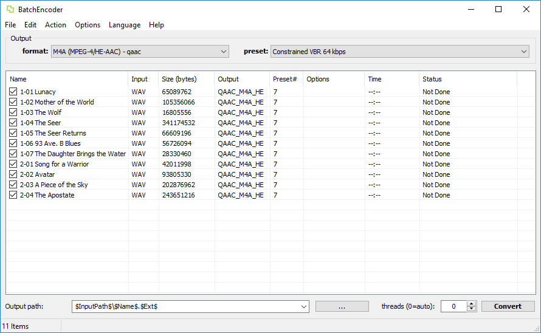
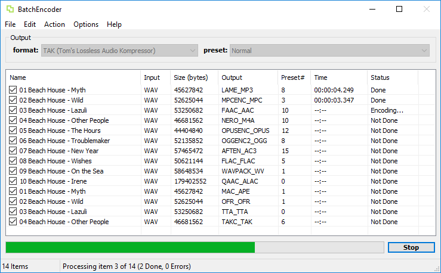
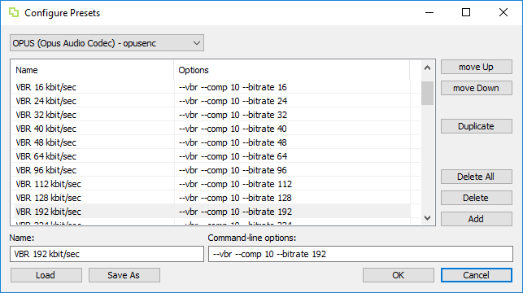
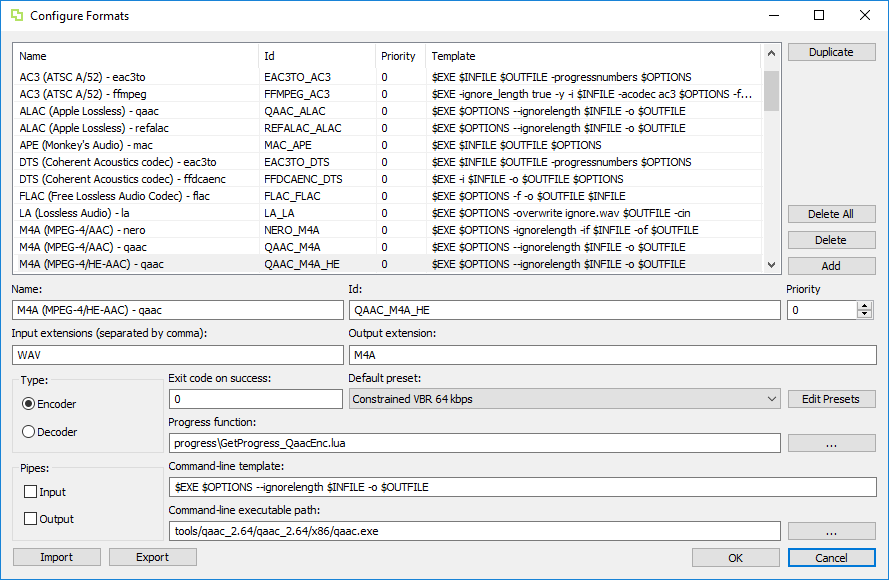
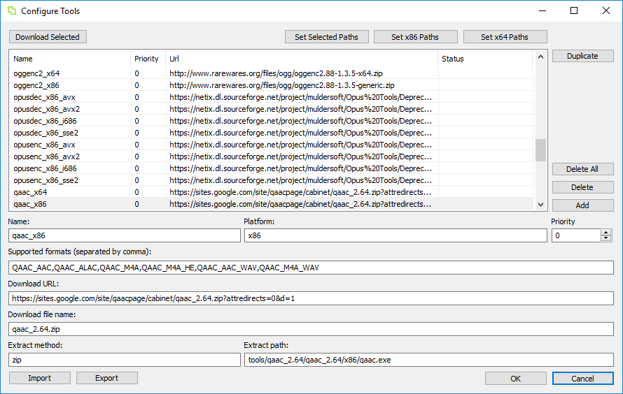

# BatchEncoder (Audio Conversion GUI)

[](https://gitter.im/wieslawsoltes/BatchEncoder?utm_source=badge&utm_medium=badge&utm_campaign=pr-badge)

[](https://ci.appveyor.com/project/wieslawsoltes/batchencoder/branch/master)

[](https://github.com/wieslawsoltes/BatchEncoder/releases)
[](https://github.com/wieslawsoltes/batchencoder/releases/latest)
[](https://github.com/wieslawsoltes/BatchEncoder/releases)

BatchEncoder is an audio files conversion software.

## Support BatchEncoder

[](https://www.paypal.com/cgi-bin/webscr?cmd=_s-xclick&hosted_button_id=GFQMG36HPYT6W)

## Download BatchEncoder

| Platform              | Type        | Version       | Download                                                                                                                               |
|-----------------------|-------------|---------------|----------------------------------------------------------------------------------------------------------------------------------------|
| Windows 32-bit        | Installer   | 2.1           | [BatchEncoder-2.1-Win32.exe](https://github.com/wieslawsoltes/BatchEncoder/releases/download/2.1/BatchEncoder-2.1-Win32.exe)           |
| Windows 64-bit        | Installer   | 2.1           | [BatchEncoder-2.1-x64.exe](https://github.com/wieslawsoltes/BatchEncoder/releases/download/2.1/BatchEncoder-2.1-x64.exe)               |
| Windows 32-bit        | Portable    | 2.1           | [BatchEncoder-2.1-Win32.zip](https://github.com/wieslawsoltes/BatchEncoder/releases/download/2.1/BatchEncoder-2.1-Win32.zip)           |
| Windows 64-bit        | Portable    | 2.1           | [BatchEncoder-2.1-x64.zip](https://github.com/wieslawsoltes/BatchEncoder/releases/download/2.1/BatchEncoder-2.1-x64.zip)               |

## System requirements

Minimum supported Windows version is Windows 7 SP1 or above, recommended is Windows 10 Anniversary Update.

Provided binaries should work under Windows XP Service Pack 3 (SP3) for x86, Windows XP Service Pack 2 (SP2) for x64.

Minimum supported Linux version is Ubutnu 16.10 (using Wine 2.0).

Command-line tools may have different hardware and software requirements. All tools have been tested under Windows 10 Anniversary Update.

## CI Builds

[Download](https://ci.appveyor.com/project/wieslawsoltes/batchencoder/build/artifacts) bleeding edge builds from the CI server.

## Mirrors

[](http://www.softpedia.com/get/Multimedia/Audio/Audio-CD-Rippers-Encoders/BatchEncoder.shtml)

## Language Editor

Download latest version of the language editor from [here](https://github.com/wieslawsoltes/LanguageEditor#download-languageeditor).

## About

BatchEncoder is an audio files conversion software. It supports most of popular audio file formats 
including lossy and lossless compression. The program is very simple to use. 
BatchEncoder is basically GUI front-end for command-line tools. All it does is create background 
processes and pass arguments to it with options set in presets/format menu and additionally 
adds input and output file paths. For specific options for each format use help available for command-line tools.

## Features

* Front-end for command-line tools.
* Supports popular audio formats.
* File transcoding between audio formats.
* Multi-threaded conversion.
* Full UNICODE support.
* Multi-language user interface.
* Out of the box configuration for new users.
* Advanced options for experienced users.
* Open-source, fast and simple.

## Screenshots

### File list

[](https://github.com/wieslawsoltes/BatchEncoder/blob/master/screenshots/FileList.png)

### Conversion progress

[](https://github.com/wieslawsoltes/BatchEncoder/blob/master/screenshots/FileListConverting.png)

### Configure presets

[](https://github.com/wieslawsoltes/BatchEncoder/blob/master/screenshots/ConfigurePresets.png)

### Configure formats

[](https://github.com/wieslawsoltes/BatchEncoder/blob/master/screenshots/ConfigureFormats.png)

### Configure tools

[](https://github.com/wieslawsoltes/BatchEncoder/blob/master/screenshots/ConfigureTools.png)

## Keyboard Shortcuts

### File Menu

| Shortcut          | Description                   |
|-------------------|-------------------------------|
| Ctrl+L            | Load List                     |
| Ctrl+S            | Save List                     |
| Ctrl+E            | Clear List                    |
| Alt+F4            | Exit                          |

### Edit Menu

| Shortcut          | Description                   |
|-------------------|-------------------------------|
| F5                | Add Files                     |
| F9                | Add Directory                 |
| F2                | Rename                        |
| F3                | Reset Time/Status             |
| F4                | Reset Output/Preset           |
| DEL               | Remove                        |
| INS               | Crop                          |
| Ctrl++            | Remove Checked                |
| Ctrl+-            | Remove Unchecked              |
| Shift++           | Check Selected                |
| Shift+-           | Uncheck Selected              |
| Ctrl+A            | Select All                    |
| Ctrl+N            | Select None                   |
| Ctrl+I            | Invert Selection              |

### Action Menu

| Shortcut          | Description                   |
|-------------------|-------------------------------|
| F9                | Convert                       |

### Options Menu

| Shortcut          | Description                   |
|-------------------|-------------------------------|
| F7                | Configure Presets             |
| F8                | Configure Formats             |
| F10               | Configure Tools               |

## Supported formats and tools

### Encoders

| Name         | Extension  | Version         | Executable        | In Pipe  | Out Pipe | Progress function                 |
|--------------|------------|-----------------|-------------------|----------|----------|-----------------------------------|
| SSRC         | WAV        | 1.33            | ssrc.exe          | no       | no       | GetProgress_SsrcEnc.progress      |
| LAME         | MP3        | 3.100           | lame.exe          | yes      | yes      | GetProgress_LameEnc.progress      |
| MPCENC       | MPC        | 1.30.0          | mpcenc.exe        | yes      | no       | GetProgress_MpcEnc.progress       |
| FAAC         | AAC        | 1.28-mod        | faac.exe          | yes      | no       | GetProgress_FaacEnc.progress      |
| QAAC         | AAC        | 2.64            | qaac.exe          | yes      | no       | GetProgress_QaacEnc.progress      |
| QAAC         | M4A        | 2.64            | qaac.exe          | yes      | no       | GetProgress_QaacEnc.progress      |
| NEROAACENC   | M4A        | 1.5.4           | neroAacEnc.exe    | yes      | no       | - none -                          |
| NEROAACENC   | MP4        | 1.5.4           | neroAacEnc.exe    | yes      | no       | - none -                          |
| OPUSENC      | OPUS       | 1.2.1-35        | opusenc.exe       | yes      | no       | GetProgress_OpusEnc.progress      |
| OGGENC       | OGG        | 2.88            | oggenc2.exe       | yes      | no       | GetProgress_OggEnc.progress       |
| AFTEN        | AC3        | git-2009122     | aften.exe         | yes      | no       | GetProgress_AftenEnc.progress     |
| FFMPEG       | AC3        | 3.4             | ffmpeg.exe        | yes      | yes      | - none -                          |
| FLAC         | FLAC       | 1.3.2           | flac.exe          | yes      | no       | GetProgress_FlacEnc.progress      |
| WAVPACK      | WV         | 5.1.0           | wavpack.exe       | no       | no       | GetProgress_WavPackEnc.progress   |
| LA           | LA         | 0.4b            | la.exe            | yes      | no       | GetProgress_LaEnc.progress        |
| MAC          | APE        | 4.18            | mac.exe           | no       | no       | GetProgress_MacEnc.progress       |
| OFR          | OFR        | 5.100           | ofr.exe           | yes      | no       | GetProgress_OfrEnc.progress       |
| TTA          | TTA        | 2.3             | tta.exe           | yes      | no       | GetProgress_TtaEnc.progress       |
| TAKC         | TAK        | 2.3.0           | takc.exe          | yes      | no       | - none -                          |
| FFDCAENC     | DTS        | 2.1.3           | ffdcaenc.exe      | yes      | yes      | GetProgress_FFdcaEnc.progress     |
| EAC3TO       | AC3        | 3.34            | eac3to.exe        | no      | no        | GetProgress_Eac3toEnc             |
| EAC3TO       | DTS        | 3.34            | eac3to.exe        | no      | no        | GetProgress_Eac3toEnc             |

### Decoders

| Name         | Extension  | Version         | Executable        | In Pipe  | Out Pipe | Progress function                 |
|--------------|------------|-----------------|-------------------|----------|----------|-----------------------------------|
| LAME         | MP1        | 3.100           | lame.exe          | yes      | yes      | GetProgress_LameDec.progress      |
| LAME         | MP2        | 3.100           | lame.exe          | yes      | yes      | GetProgress_LameDec.progress      |
| LAME         | MP3        | 3.100           | lame.exe          | yes      | yes      | GetProgress_LameDec.progress      |
| MPCDEC       | MPC        | 1.0             | mpcdec.exe        | no       | no       | GetProgress_MpcDec.progress       |
| MPCDEC       | MPP        | 1.0             | mpcdec.exe        | no       | no       | GetProgress_MpcDec.progress       |
| MPCDEC       | MP+        | 1.0             | mpcdec.exe        | no       | no       | GetProgress_MpcDec.progress       |
| FAAD         | AAC        | faad2-20100614  | faad.exe          | no       | yes      | GetProgress_FaadDec.progress      |
| QAAC         | AAC        | 2.64            | qaac.exe          | no       | no       | GetProgress_QaacDec.progress      |
| QAAC         | M4A        | 2.64            | qaac.exe          | no       | no       | GetProgress_QaacDec.progress      |
| NEROAACDEC   | MP4        | 1.5.1           | neroAacDec.exe    | no       | yes      | - none -                          |
| NEROAACDEC   | M4A        | 1.5.1           | neroAacDec.exe    | no       | yes      | - none -                          |
| OPUSDEC      | OPUS       | 1.2.1-35        | opusdec.exe       | yes      | no       | GetProgress_OpusDec.progress      |
| OGGDEC       | OGG        | 1.10.1          | oggdec.exe        | no       | no       | GetProgress_OggDec.progress       |
| FLAC         | FLAC       | 1.3.2           | flac.exe          | yes      | no       | GetProgress_FlacDec.progress      |
| WVUNPACK     | WV         | 5.1.0           | wvunpack.exe      | no       | no       | GetProgress_WvUnpackDec.progress  |
| LA           | LA         | 0.4b            | la.exe            | yes      | no       | GetProgress_LaDec.progress        |
| MAC          | APE        | 4.18            | mac.exe           | no       | no       | GetProgress_MacDec.progress       |
| MAC          | MAC        | 4.18            | mac.exe           | no       | no       | GetProgress_MacDec.progress       |
| OFR          | OFR        | 5.100           | ofr.exe           | yes      | no       | GetProgress_OfrDec.progress       |
| TTA          | TTA        | 2.3             | tta.exe           | no       | yes      | GetProgress_TtaDec.progress       |
| TAKC         | TAK        | 2.3.0           | takc.exe          | no       | yes      | - none -                          |
| FFMPEG       | AC3        | 3.4             | ffmpeg.exe        | yes      | yes      | - none -                          |
| FFMPEG       | EAC3       | 3.4             | ffmpeg.exe        | yes      | yes      | - none -                          |
| FFMPEG       | DTS        | 3.4             | ffmpeg.exe        | yes      | yes      | - none -                          |
| FFMPEG       | DTSHD      | 3.4             | ffmpeg.exe        | yes      | yes      | - none -                          |
| FFMPEG       | TRUEHD     | 3.4             | ffmpeg.exe        | yes      | yes      | - none -                          |
| FFMPEG       | MKA        | 3.4             | ffmpeg.exe        | yes      | yes      | - none -                          |
| AVSDEC       | AVS        | 1.0             | AvsDec.exe        | no       | no       | GetProgress_AvsDec.progress       |

### Tool downloads

To get required command-line tools use `Configure Tools` dialog. Use the `Download Selected` button to download selected tools.

For more information about tools please see the [wiki page](https://github.com/wieslawsoltes/BatchEncoder/wiki/Tools).

There is also available PowerShell [download script](https://github.com/wieslawsoltes/BatchEncoder/blob/master/scripts/download.ps1) for all supported tools.

Open up a Powershell prompt and execute the download script:
```PowerShell
PS> .\download.ps1 -Path "Tools"
```

The `-Path` parameter is optional and if not provided the script will download to the current directory.

If you having problems running the PowerShell `download.ps1` script see this [instructions](http://stackoverflow.com/a/2035209).

| Name            | Downloads                                                                                                                           |
|-----------------|-------------------------------------------------------------------------------------------------------------------------------------|
| SSRC            | [http://shibatch.sourceforge.net/](http://shibatch.sourceforge.net/)                                                                |
| LAME            | [http://rarewares.org/mp3-lame-bundle.php](http://rarewares.org/mp3-lame-bundle.php)                                                |
| MPPENC          | [https://musepack.net/index.php?pg=win](https://musepack.net/index.php?pg=win)                                                      |
| MPCDEC          | [https://musepack.net/index.php?pg=win](https://musepack.net/index.php?pg=win)                                                      |
| FAAC            | [http://rarewares.org/aac-encoders.php](http://rarewares.org/aac-encoders.php)                                                      |
| FAAD            | [http://rarewares.org/aac-decoders.php](http://rarewares.org/aac-decoders.php)                                                      |
| OPUSENC         | [https://sourceforge.net/projects/muldersoft/files/Opus%20Tools/](https://sourceforge.net/projects/muldersoft/files/Opus%20Tools/)  |
| OPUSDEC         | [https://sourceforge.net/projects/muldersoft/files/Opus%20Tools/](https://sourceforge.net/projects/muldersoft/files/Opus%20Tools/)  |
| OGGENC          | [http://rarewares.org/ogg-oggenc.php](http://rarewares.org/ogg-oggenc.php)                                                          |
| OGGDEC          | [http://rarewares.org/ogg-oggdec.php](http://rarewares.org/ogg-oggdec.php)                                                          |
| AFTEN           | [https://github.com/wieslawsoltes/wavtoac3encoder/releases](https://github.com/wieslawsoltes/wavtoac3encoder/releases)              |
| FLAC            | [https://xiph.org/flac/download.html](https://xiph.org/flac/download.html)                                                          |
| WAVPACK         | [http://www.wavpack.com/downloads.html](http://www.wavpack.com/downloads.html)                                                      |
| WVUNPACK        | [http://www.wavpack.com/downloads.html](http://www.wavpack.com/downloads.html)                                                      |
| QAAC            | [https://sites.google.com/site/qaacpage/cabinet](https://sites.google.com/site/qaacpage/cabinet)                                    |
| LA              | [http://www.lossless-audio.com/download.htm](http://www.lossless-audio.com/download.htm)    
| MAC             | [http://www.monkeysaudio.com/download.html](http://www.monkeysaudio.com/download.html)                                              |
| OFR             | [http://losslessaudio.org/Downloads.php](http://losslessaudio.org/Downloads.php)                                                    |
| TTA             | [https://sourceforge.net/projects/tta/files/tta/ttaenc-win/](https://sourceforge.net/projects/tta/files/tta/ttaenc-win/)            |
| TAKC            | [http://www.thbeck.de/Tak/Tak.html](http://www.thbeck.de/Tak/Tak.html)                                                              |
| NEROAACENC      | [http://www.videohelp.com/software/Nero-AAC-Codec](http://www.videohelp.com/software/Nero-AAC-Codec)                                |
| NEROAACDEC      | [http://www.videohelp.com/software/Nero-AAC-Codec](http://www.videohelp.com/software/Nero-AAC-Codec)                                |
| FFMPEG          | [https://ffmpeg.zeranoe.com/builds/](https://ffmpeg.zeranoe.com/builds/)                                                            |
| FFDCAENC        | [https://github.com/filler56789/ffdcaenc-2](https://github.com/filler56789/ffdcaenc-2/releases)                                     |
| EAC3TO          | [http://forum.doom9.org/showthread.php?t=125966](http://forum.doom9.org/showthread.php?t=125966)                                    |
| AVSDEC          | [https://github.com/wieslawsoltes/AvsDec/releases](https://github.com/wieslawsoltes/AvsDec/releases)                                |

## Configuration files

* Program configuration files are stored in `%appdata%\BatchEncoder` folder for installed version.
* Downloaded tool are stored in `%appdata%\BatchEncoder\tools` folder for installed version.
* To enable portable mode create empty file `BatchEncoder.portable` in same directory as `BatchEncoder.exe` file.
* Program configuration files are stored in `.\BatchEncoder` folder for portable version.
* Downloaded tool are stored in `.\BatchEncoder\tools` folder for portable version.
* System registry is not used to store program settings. 
* Configuration file are in `XML` text format with `UTF-8` encoding.

Files extensions:

* .xml - Any configuration file
* .options - Program options
* .formats - Encoder and decoder formats definition
* .format - Encoder and decoder format definition
* .presets - Predefined format presets definition
* .tools - Encoder and decoder tools definition
* .tool - Encoder and decoder tool definition
* .items - Input file items
* .progress - Progress function Lua scripts
* .language - Language translation strings

Use only `UTF-8` compatible text editors (e.g. Notepad) to edit xml configuration files.

### Default configuration files

The default configuration files can be found [here](https://github.com/wieslawsoltes/BatchEncoder/tree/master/config).

## Output path format

Possible `output path` configurations:

* `""` -> empty string is same as `$SourceDirectory$`
* `$SourceDirectory$` -> same as $SourceDirectory$\\`$Name$`.`$Ext$`
* `$SourceDirectory$`\\`$Name$`.`$Ext$`
* `$SourceDirectory$`\\`$Name$`_converted.`$Ext$`
* `$SourceDirectory$`\\Converted\\`$Name$`.`$Ext$`
* C:\\Output -> same as C:\\Output\\Path\\`$Name$`.`$Ext$`
* C:\\Output\\`$Name$`.`$Ext$`
* C:\\Output\\`$Name$`_converted.`$Ext$`

Variables:

* `$SourceDirectory$` - input file path.
* `$Name$` - input item name.
* `$Ext$` - output format extension.

You can add also custom text inside `output path`.

Valid `output path` configurations:

* If output path is empty only input file directory is used (name and extension are added automatically).
* If `$SourceDirectory$`, `$Name$` and `$Ext$` variables are missing full output path must be provided by user (ignore input file path and variables)
* If `$SourceDirectory$`, `$Name$` and `$Ext$` variables are present input source file path is used with item `Name` and output format extension.
* If `$SourceDirectory$` is missing and `$Name$` and `$Ext$` variables are present item `Name` and output format extension are used (full output path must be provided by user, if not program writes output files to the BatchEncoder directory).
* If only `$SourceDirectory$` variable is present input source file path is used (name and extension are added automatically)

## Format specification

### Template format

| Variable        | Description                                                                                        |
|-----------------|----------------------------------------------------------------------------------------------------|
| $EXE            | Executable path replaced with format `path` attribute.                                             |
| $OPTIONS        | Executable command-line options replaced with preset `options` attribute.                          |
| $INFILE         | Input file path (if pipes are supported `-` is automatically used).                                |
| $OUTFILE        | Output file path (if pipes are supported `-` is automatically used).                               |

The output file name is generated from the combination of output path, item `name` attribute and output format `extension` attribute.

Default template format order is `$EXE $OPTIONS $INFILE $OUTFILE`. 

You can also add custom options (additional command-line parameters) and text inside the `template` string.

### Type, input and output extensions

BatchEncoder does support file trans-coding. To enable this you have to configure proper `Decoder` formats.

BatchEncoder will chech input file extensions and if `Encoder` format `Input extensions` (multiple extension are supported,
separated by comma `,` e.g.: WAV,WV,CAF,W64,DFF,DSF, but only one `Output extension` e.g. WV) does not match the input file extension 
than BatchEncoder will search for `Decoder` that does support this input file extension. 

### Pipes configuration

Pipes configuration provides information to BatchEncoder whether the command-line tool has support 
to read/write data from/to stdin/stdout pipes.

* The input pipe means that encoder/decoder can directly read dat  from stdin and does not need input file name.
* The output pipe means that encoder/decoder can directly write data to stdout and does not need output file name.
* When encoder/decoder supports input pipe BatchEncoder reads file data and streams this data into encoder/decoder input pipe (stdin).
* When encoder/decoder supports output pipe BatchEncoder writes data to a file using encoder/decoder output pipe stream (stdout).
* Usually you can specify pipe support in command-line options by using "-" instead of input/output file name.

The input pipes support allows BatchEncoder to get current progress status by counting read bytes, 
instead of relying on console text output (this is done by reading encoder/decoder stderr pipe output). 

To get console output BatchEncoder is parsing text read from stderr pipe and uses provided GetProgress function
for specific tool. There are cases when stderr output is delayed by tool (stderr pipe buffer is not flushed)
and resulting in progress status can be delay.

Also when you want to do more complicated operations like transscoding you can for example connect pipes 
between one encoder output (stdout) and others decoder input (stdin). This case is not yet support by BatchEncoder.

The best case scenario is when encoder/decoder tool does support both input and output pipes, this gives BatchEncoder more 
control over encoding/decoding and trans-coding processes, also in case of trans-coding you do not need temporary files 
as data can be streamed between tools directly without temporary storage and in result you can get much better performance.

Unfortunately not all command-line tools provide support for pipes, some only support stdin pipes (mainly encoders) 
and some support only stdout pipes (mainly decoders). In this cases BatchEncoder depending on pipes input/output 
and progress function configuration selects best possible option to do conversion process. 

Sometimes you will not get nice progress during conversion, nonetheless you will successfully convert files.

### Progress function format

Progress function are simple [Lua](http://www.lua.org/manual/5.3/) scripts with defined `GetProgress` function. The `progress` file extension is used instead of `lua`.

The progress function signature:

```
function GetProgress(s)
```

Most of the Lua progress scripts are using [string manipulation](http://www.lua.org/manual/5.3/manual.html#6.4) with [patterns](http://lua-users.org/wiki/PatternsTutorial).

For a quick start use one of the [existing](https://github.com/wieslawsoltes/BatchEncoder/tree/master/config/progress) progress scripts.

### Default progress functions

The default progress functions sources can be found [here](https://github.com/wieslawsoltes/BatchEncoder/tree/master/config/progress).

## Translations

* [English (en-US)](https://github.com/wieslawsoltes/BatchEncoder/blob/master/config/lang/en-US.language) by Wiesław Šoltés
* [Polish (pl-PL)](https://github.com/wieslawsoltes/BatchEncoder/blob/master/config/lang/pl-PL.language) by Wiesław Šoltés
* [Korean (ko-KR)](https://github.com/wieslawsoltes/BatchEncoder/blob/master/config/lang/ko-KR.language) by JaeHyung Lee
* [Spanish (es-ES)](https://github.com/wieslawsoltes/BatchEncoder/blob/master/config/lang/es-ES.language) by Overdrive80, tebasuna51

Use only UTF-8 compatible text editors (e.g. Notepad or Visual Studio Code) to edit xml language files
and [use special characters in XML](https://www.dvteclipse.com/documentation/svlinter/How_to_use_special_characters_in_XML.3F.html#gsc.tab=0).

Language files have to be placed in the same directory as the `BatchEncoder.exe` executable to be loaded automatically.

Language files can also be edited in dedicated [LanguageEditor](https://github.com/wieslawsoltes/LanguageEditor#download-languageeditor) program. LanguageEditor requires .NET Framework 4.5 and Windows 7 SP1 or above.

The default language files can be found [here](https://github.com/wieslawsoltes/BatchEncoder/tree/master/config/lang).

## Troubleshooting

To report issues please use [issues tracker](https://github.com/wieslawsoltes/BatchEncoder/issues).

For more informations and help please visit [this forum thread](http://forum.doom9.org/showthread.php?t=174242).

## Sources

Sources are available in the [git source code repository](https://github.com/wieslawsoltes/BatchEncoder/).

## Build

### Prerequisites

```
git clone https://github.com/wieslawsoltes/BatchEncoder.git
cd BatchEncoder
git submodule update --init --recursive
```

### Install Visual Studio 2017

* [VS 2017](https://www.visualstudio.com/pl/downloads/)

### Windows 7 SDK

For Windows XP compatibility program is compiled using `Platform Toolset` for `Visual Studio 2017 - Windows XP (v141_xp)`.

For more details please read [Configuring Programs for Windows XP](https://msdn.microsoft.com/en-us/library/jj851139.aspx).

### Build Solution
```
Open BatchEncoder.sln in Visual Studios 2017 or above.
```

### Dependencies

* [MfcToolkit](https://github.com/wieslawsoltes/MfcToolkit)
* [AvsDec](https://github.com/wieslawsoltes/AvsDec)
* [TinyXml-2 v5.0.1](https://github.com/leethomason/tinyxml2)
* [Lua v5.3.4](http://www.lua.org/ftp/)

## License

BatchEncoder (Audio Conversion GUI) is licensed under the [MIT license](LICENSE.TXT).
